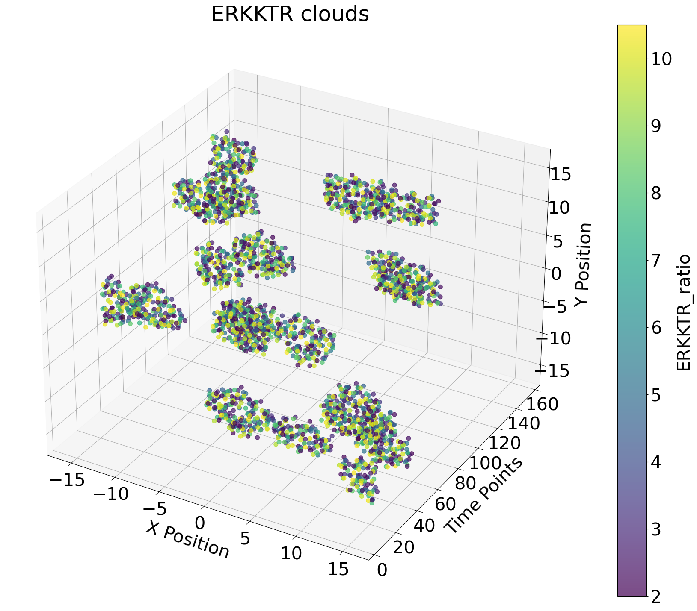

# Point/Graph Neural Network for Wave Detection in Cell Signalling

We aim to create a neural network that can reliably identify intercellular signals in cancer epithelium. Instead of using traditional image analysis, we are tyring to reduce the data size by representing the cells in the tissue over time as points in a point cloud. In the cloud, the x- and y-axis are the coordinates of the cell in the original microscopy image and the z-axis represents time. 

    
    

## Data Creation
For the purpose of this project we used simulated data created with NetLogo. All the code for the simulations can be found in the `data` folder. The data can be created using the `netlogo_sim.sh` file, which automatically reruns the NetLogo model several times, then adds noise into it and randomly cuts the data such that the point clouds have different sizes. Since NetLogo outputs a .csv file for every time point in a model, we also take all the output files together into one `whole_dataset.csv`. 

A test dataset can be found there as well: `test_data.zip`. The GNN only takes a zipped .csv file as input, so make sure to have your data compressed.

## Running the GNN
Once the data has been created, the main model can be run from the `/source_inst/train_model.py` file. The adjustable parameters can be found in the beginning of the training file or with `python train_model.py -h`.
To run a basic version of the GNN run `python train_model.py -d ./data/test_data.zip` in terminal after activating the conda environment provided in `pointcnn-env-linux.yml`. 
